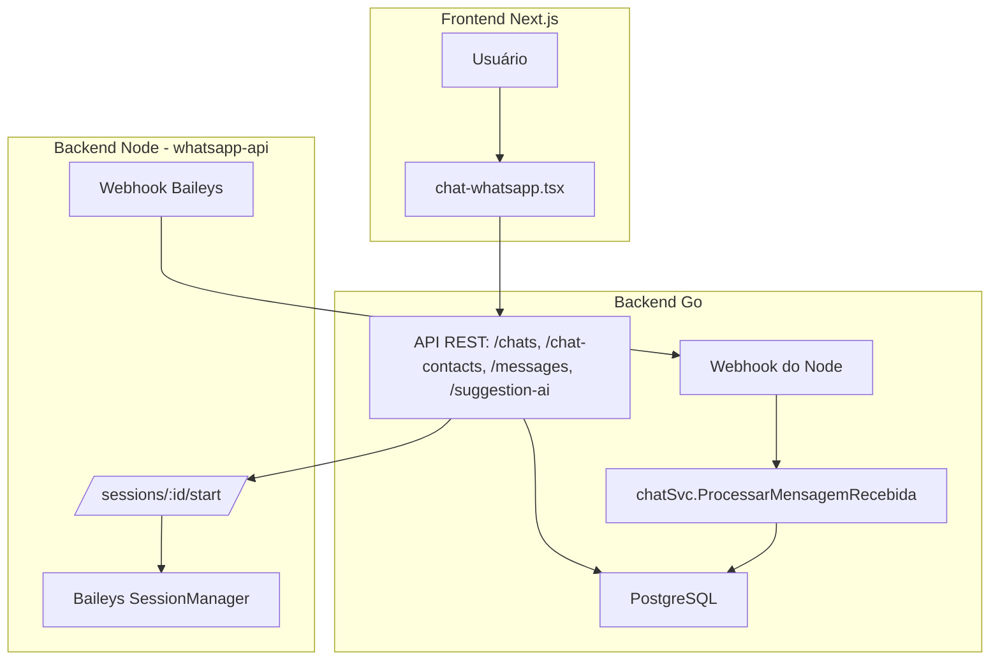

```mermaid
graph TD
  subgraph Frontend Next.js
    A[Usuário] --> B[chat-whatsapp.tsx]
  end

  subgraph Backend Go
    B --> C[API REST: /chats, /chat-contacts, /messages, /suggestion-ai]
    E[Webhook do Node] --> F[chatSvc.ProcessarMensagemRecebida]
    C --> G[PostgreSQL]
    F --> G
  end

  subgraph Backend Node - whatsapp-api
    B2[/sessions/:id/start/] --> H[Baileys SessionManager]
    D1[Webhook Baileys] --> E
    C --> B2
  end
```
