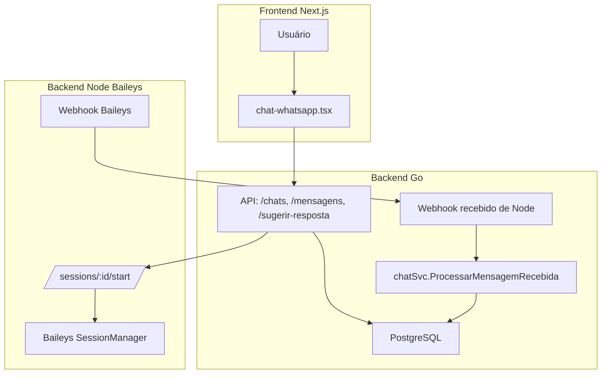

```mermaid
graph TD
  subgraph Frontend Next.js
    A[Usuário] --> B[chat-whatsapp.tsx]
  end

  subgraph Backend Go
    B --> C[API: /chats, /mensagens, /sugerir-resposta]
    E[Webhook recebido de Node] --> F[chatSvc.ProcessarMensagemRecebida]
    C --> G[PostgreSQL]
    F --> G
  end

  subgraph Backend Node Baileys
    C2[/sessions/:id/start/] --> H[Baileys SessionManager]
    D1[Webhook Baileys] --> E
    C --> C2
  end

```
