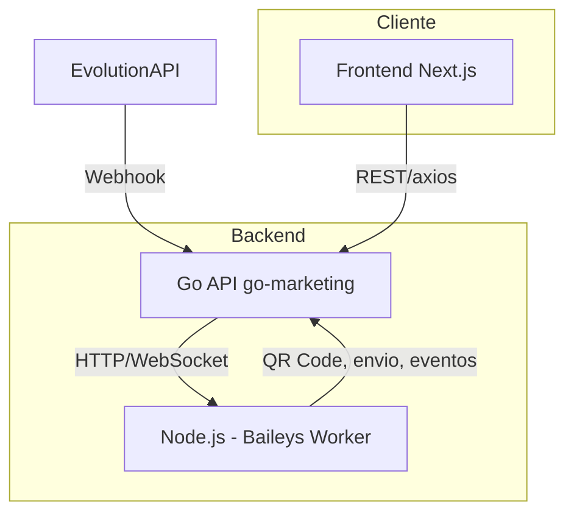

```mermaid
graph TD
  subgraph Cliente
    C1[Frontend Next.js]
  end

  subgraph Backend
    G1[Go API go-marketing]
    N1[Node.js - Baileys Worker]
  end

  EvolutionAPI -- Webhook --> G1
  C1 -- REST/axios --> G1
  G1 -- HTTP/WebSocket --> N1
  N1 -- QR Code, envio, eventos --> G1
```
