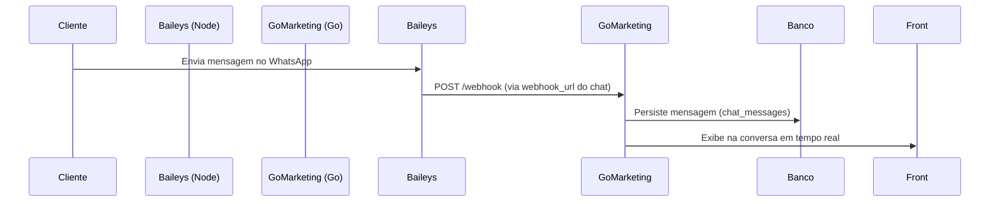

```mermaid
sequenceDiagram
    participant Cliente
    participant Baileys (Node)
    participant GoMarketing (Go)

    Cliente->>Baileys: Envia mensagem no WhatsApp
    Baileys->>GoMarketing: POST /webhook (via webhook_url do chat)
    GoMarketing->>Banco: Persiste mensagem (chat_messages)
    GoMarketing->>Front: Exibe na conversa em tempo real
```
