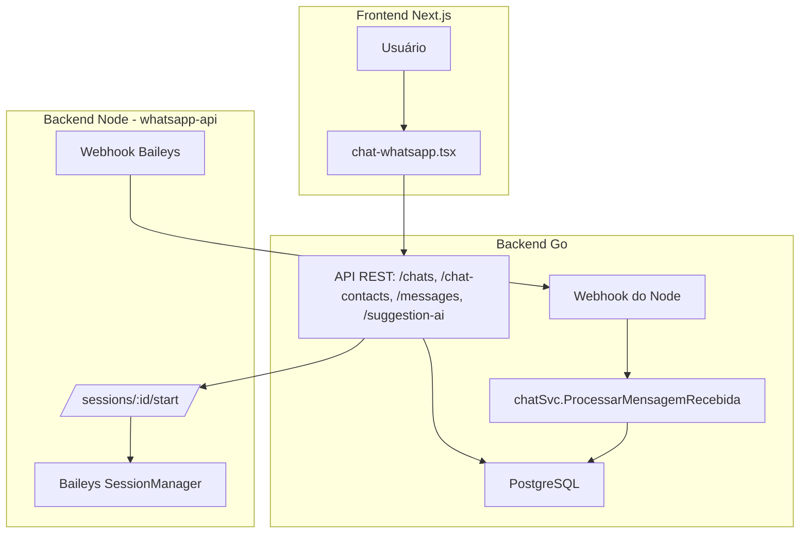

# 🚀 GoMarketing + WhatsApp API (Baileys) – Resumo Técnico Atualizado

## 🎯 Visão Geral

Sistema completo de atendimento via WhatsApp com assistência por IA, construído em arquitetura desacoplada com:

- **Backend Go** (GoMarketing): persistência, lógica de negócio e integração com OpenAI.
- **Node.js + Baileys** (whatsapp-api): sessões reais do WhatsApp Web.
- **Frontend Next.js** (next-marketing): interface modular, reativa e integrada ao Copiloto IA.

---

## 🏗️ Arquitetura

---

## ✅ Funcionalidades Implementadas

- [x] **Sessões WhatsApp com Baileys** – múltiplas instâncias, QRCode, restauração automática.
- [x] **Envio/recebimento de mensagens** via Webhook entre Node e Go.
- [x] **Sugestões de resposta com IA** usando contexto da conversa.
- [x] **Componentes frontend completos** (Chat, Sidebar, Input, Sugestões IA).
- [x] **Scroll automático**, **edição inline da sugestão IA**, e **markdown renderizado**.
- [x] **Validação e enriquecimento automático de contatos** com IA e dados do perfil comercial.
- [x] **Atualização de `session_status`** com estado real da conexão.

---

## 📌 Próximos Passos

### 🧠 IA e Conversação

- [ ] Melhorar prompts considerando histórico da conversa.
- [ ] Ajustar instruções do `systemPrompt` para evitar repetições (“Olá, Jean Carlos!”, “Atenciosamente...”)

### 🖥️ Frontend

- [ ] Alertas e mensagens em tempo real via WebSocket.
- [ ] Botão “Reconectar Sessão” quando status for `desconectado`.
- [ ] Visual refinado do chat: balões, inputs, sugestões.

### 🔌 WebSocket em Go

- [ ] Estrutura com `nhooyr.io/websocket`.
- [ ] Cada chat mantém um canal ativo.
- [ ] Emitir eventos: nova mensagem, sugestão IA, mudança de status.

### 🗂️ Sessões & Monitoramento

- [ ] Persistir sessões em S3 no lugar de disco local.
- [ ] Implementar painel de monitoramento no frontend.
- [ ] Exclusão segura de sessões inativas.

---

## 🧠 Observações Finais

A estrutura atual oferece base sólida para atendimento automatizado, multicanal e escalável, com IA contextual, integração de contatos e visual moderno.

---

### ✅ Últimas Versões

| App            | Última Tag     |
| -------------- | -------------- |
| GoMarketing    | `v1.2.2-alpha` |
| whatsapp-api   | `v0.2.0-alpha` |
| next-marketing | `v0.5.0-alpha` |

---

📅 Atualizado em: 30/05/2025
