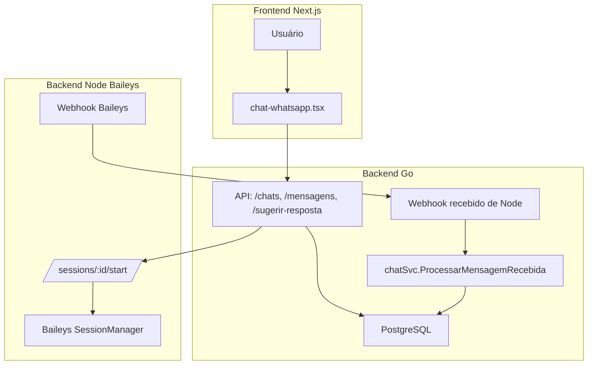

# 📦 Projeto GoMarketing + WhatsApp API (Baileys)

## 🧠 Visão Geral

O projeto visa integrar um sistema de atendimento inteligente via WhatsApp utilizando o GoMarketing (backend em Go), um frontend em Next.js e uma API intermediária utilizando Baileys (Node.js). A arquitetura foi desenhada para suportar múltiplas instâncias de WhatsApp, controle técnico das sessões e assistência via IA para atendentes humanos.

### 🧩 Arquitetura

### 🔁 Conectividade

- O Baileys cria e mantém sessões de WhatsApp via WebSocket (conexão direta com os servidores da Meta).
- Cada sessão tem uma `sessionId` correspondente ao campo `evolution_instance` do modelo `Chat` no GoMarketing.
- O backend em Go inicia e monitora sessões via API REST com `POST /start`, `GET /qrcode`, etc.
- A sessão é restaurada automaticamente no `startup.js` do `whatsapp-api`, utilizando os arquivos salvos localmente.

---

## ✅ Status Atual do MVP

- [x] Integração funcional entre Go, Node (Baileys) e Next.js
- [x] Webhook recebendo mensagens do cliente (via Baileys)
- [x] Envio de mensagens manuais e IA do servidor para cliente via Baileys
- [x] Persistência de mensagens e contatos em PostgreSQL
- [x] Exibição do QRCode no frontend e terminal
- [x] Restauração automática das sessões após reboot
- [x] Chave API entre serviços validada por header

---

## 🧱 Decisões Técnicas

- ✔️ Conectividade entre sistemas via HTTP e JSON
- ✔️ Uso de `nhooyr.io/websocket` para sockets em Go
- ✔️ Go (+go1.22.1) com `net/http`, sem router externo
- ✔️ Frontend modular com controle por abas e sessão por Chat

---

## 📌 Próximos Passos

### 🔄 Sincronização & Status

## 📌 Próximos Passos

### 🔄 Sincronização & Status

- [x] Adicionar `session_status` em chats
- [x] Usar `session_status` para refletir:
  - `desconhecido`: (Sessão nunca iniciada)
  - `aguardando_qr`: (Sessão iniciada, QR gerado, aguardando escaneamento)
  - `qrcode_expirado`: (QR expirou antes da autenticação)
  - `conectado`: (Sessão ativa e autenticada)
  - `desconectado`: (Sessão caiu ou foi finalizada)
  - `erro`: (Erro técnico crítico no processo de sessão)
- [x] Renomear `evolution_instance` do chat para `instance_name` (independente de conector WhatsApp)
- [x] Criar endpoint no Go: `POST /chats/:id/update-session-status`
- [x] Adicionar rotina no `whatsapp-api` para notificar o status atual ao Go

### 🖥️ Frontend

- [x] Mostrar status visual da sessão no chat (ex: verde, vermelho, amarelo)
- [ ] Exibir alertas para mensagens recebidas em tempo real (WebSocket)
- [ ] Botão "reconectar sessão" se `session_status = desconectado`

### ⚙️ WebSocket com Go

- [ ] Criar estrutura de WebSocket com `nhooyr.io/websocket`
- [ ] Gerenciar conexões por chat ativo
- [ ] Enviar notificações: nova mensagem, mudança de status, etc.

### 📥 Sessões Persistidas

- [ ] Persistir sessões do Baileys em S3 futuramente (atualmente apenas disco)
- [ ] Implementar exclusão segura de sessões no Go + Node
- [ ] Criar um painel administrativo para listar e monitorar sessões ativas

---

## 🧠 Considerações

O projeto está avançando de um MVP para uma solução robusta de atendimento multicanal com inteligência artificial e integração nativa com WhatsApp. A arquitetura atual permite fácil escalabilidade e separação de responsabilidades entre os serviços.
